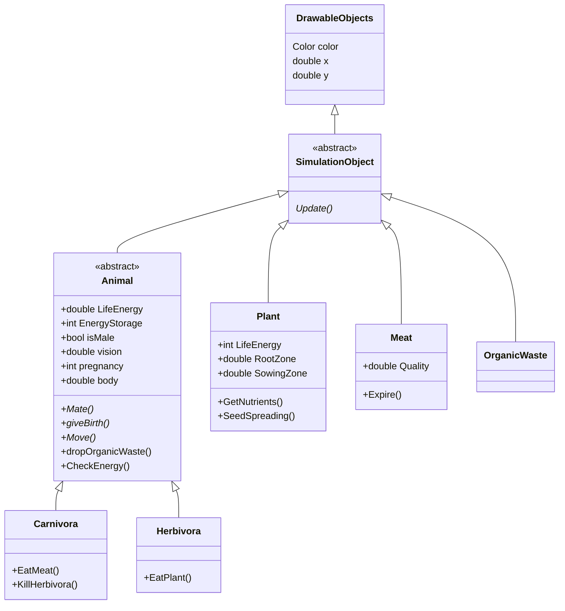
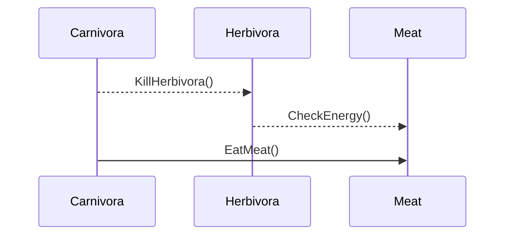

# Diagramme de classe

# Diagramme de sequence

# Principe SOLID
Deux principes SOLID utilisé dans le code vont être utilisé dans cette partie.
Premier principe : Single Responsability Principle. Ce principe  veut qu'une méthode, classe ne représente qu'une seule chose/fasse qu'une seule action. Dans le code, on remarque que les classes représente bien qu'un seul type d'objet du monde réel. Quant aux
méthodes, elles n'ont toujours qu'un but : soit modifier un attribut d'un objet, soit ajouter ou retirer un élément d'une liste en fonction de la valeur d'un attribut (ou les deux quand cela a du sens).
Deuxième principe : Open/closed principle. Les classes peuvent facilement acceuillir de nouvelles méthodes (extensions) mais modifier ou supprimer ce qui est déjà présent n'est pas utile voire posiible, vu que les méthodes n'ont déjà qu'un seul but précis (en vertue du premeir principe).

